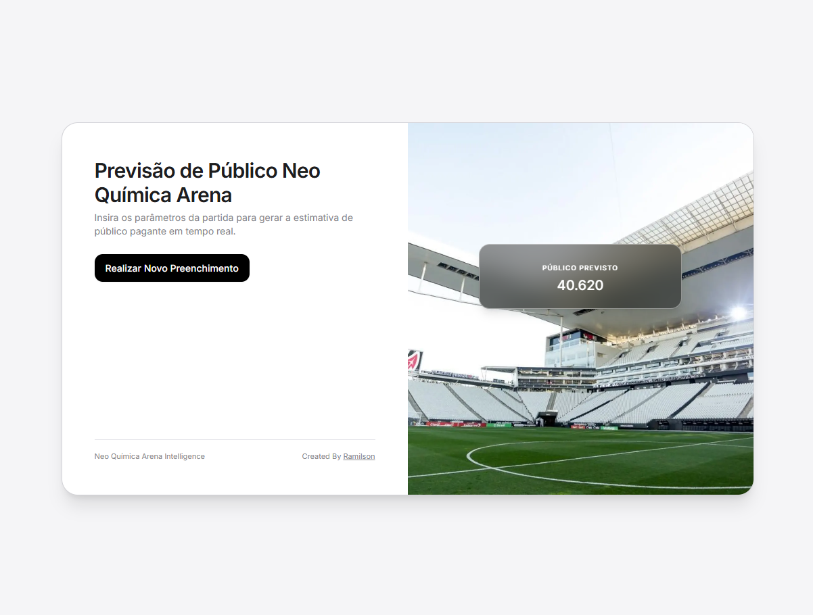
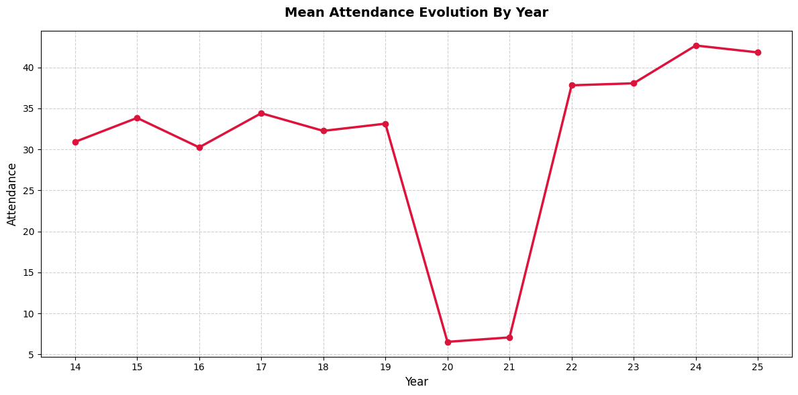
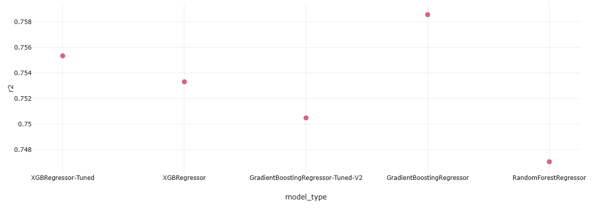
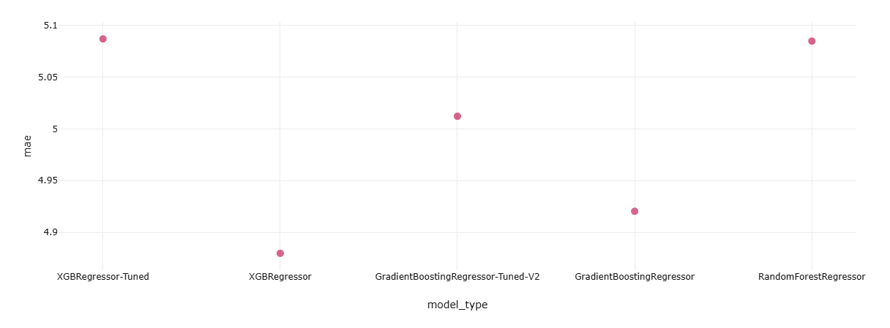
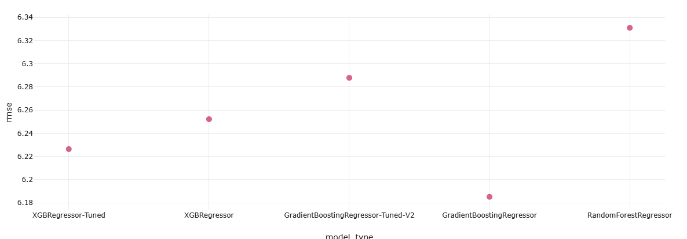

# Arena Corinthians Match Attendance Predictor 🏟️⚽
Machine learning model and data pipeline for forecasting football match attendance at Corinthians' Neo Química Arena.




## 🎯 Business Objective
Accurately predicting match attendance enables stadium management and operations to:
* **Optimize Services:** Ensure appropriate staffing for food, beverage, and ticketing operations.
* **Enhance Operations & Security:** Improve crowd control, logistics, and stadium safety.
* **Cost Efficiency:** Reduce operational waste by aligning resources directly with expected crowd sizes.

---

## 📊 Dataset & Credits
* **Source:** [Kaggle - Arena Corinthians Dataset](https://www.kaggle.com/datasets/danilosoares/arena-corinthians)
* **Creator:** Originally compiled and curated by **Timão Dados @TimaoDados** (Twitter/X profile).

---

## 🛠️ Tech Stack & Tools
* **Programming Language:** Python
* **Data Manipulation & Modeling:** Pandas, Scikit-Learn, NumPy
* **Data Versioning:** DVC (Data Version Control)
* **Experiment Tracking:** MLflow
* **Containerization & Deployment:** Docker, AWS EC2, FastAPI


---

## 🛠️ Prerequisites

Make sure you have **Python 3.10+** installed on your system.

---

## 🚀 How to Run the Project

Follow the steps below to set up your environment and execute the complete pipeline:

### 1. Clone the Repository and Create a Virtual Environment
Open your terminal in the root directory of the project and create a virtual environment (`.venv`):

```bash
# Create the virtual environment
python -m venv .venv

# Activate the virtual environment (On Windows / PowerShell)
.venv\Scripts\Activate.ps1

# Activate the virtual environment (On Linux / Mac)
source .venv/bin/activate

```

### 2. Install Dependencies
```bash
pip install -r requirements.txt
```

or 

```bash
python -m pip install -r requirements.txt
```

### 3. Organize the Raw Data
Ensure that the original dataset file is placed correctly in the following directory:
```bash
data/raw/dataset.csv
```

### 4. Run Preprocessing
Execute the data cleaning and feature engineering script. This will generate the training (train.csv) and testing (test.csv) files inside the data/processed/ directory:

```bash
python src/data/preprocess.py
```

### 5. Run Preprocessing
Execute the Random Forest training script. The model will be trained and evaluated, and all metrics, parameters, and artifacts (such as model.skops) will be automatically logged to MLflow via a local SQLite database (mlflow.db):

```bash
python src/models/train-random-forest.py
```

### 6. View Results in the MLflow UI
To inspect the performance metrics (such as $R^2$ and MAE) and the generated artifacts, launch the MLflow web interface pointing to the local SQLite database:
```bash
mlflow ui --backend-store-uri sqlite:///mlflow.db
```

### 7. Run API
```bash
uvicorn api.main:app --reload
```
And access 
```bash
http://127.0.0.1:8000
```
---

## 🏗️ Project Architecture
```text
arena-corinthians-attendance-predictor/
│
├── data/
│   ├── raw/                 # Raw dataset from Kaggle (tracked by DVC)
│   └── processed/           # Cleaned data and feature engineered sets
│
├── notebooks/               # Exploratory Data Analysis (EDA)
│
├── src/                     # Modularized production source code
│   ├── preprocessing.py
│   ├── train.py
│   └── main.py
├── api/                     # Build Routes and FrontEnd
│   ├── templates            # HTML Code
|   └── main.py
├── artifacts/               # Saved model binaries (.pkl) and encoders
├── mlruns/                  # Local MLflow experiment tracking logs
├── requirements.txt         # Project dependencies
└── README.md
```

---

### Exploratory Data Analysis (EDA)

In `notebooks/01-eda.ipynb`, we analyze the relationship and temporal evolution of the mean attendance by year at the Neo Química Arena. 

A sharp drop in attendance is clearly visible during **2020 and 2021**, directly resulting from stadium access restrictions and public health protocols during the COVID-19 pandemic (spanning from the match on February 26, 2020, up to the return of fans on November 1, 2021).

| Mean Attendance by Year |
| :----------------------: |
|  |

[Reference](https://www.tudotimao.com.br/noticia/159661/veja-como-a-torcida-viveu-o-corinthians-no-periodo-de-portoes-fechados)
[Reference](https://www.meutimao.com.br/jogo/5930/brasileirao-2021/corinthians-1-x-0-chapecoense)


--- 

### Data Cleaning

The work was minimal, as the dataset was already well-handled by its creator (**Timão Dados @TimaoDados**). I only removed a few columns that cannot be verified before a match takes place or columns with no predictive value (e.g. Match ID): `JOGO` (Match ID), `RESULTADO` (Result), `CORINTHIANS` (Corinthians), `GOL COR` (Corinthians Goals), `GOL VIS` (Visiting Team Goals), `CAPITÃO` (Captain), `TÉCNICO` (Manager), `TÉCNICO - VISITANTE` (Visiting Manager), `RENDA` (Match Revenue / Gate Receipts), `CAMISA` (Jersey), `SAÍDA DE JOGO` (Kickoff / Team that Kicked Off), `1 TEMPO` (1st Half), `2 TEMPO` (2nd Half), `ARTILHEIROS` (Scorers), `ARTILHEIROS - VISITANTE` (Visiting Scorers), `NUM-GOLS` (Number of Goals), `PRIMEIRO GOL` (First Goal), `GOL-SUL` (South Goal - Corinthians), `GOL-NORTE` (North Goal - Corinthians), `GOL VIS-SUL` (South Goal - Visitor), `GOL VIS-NORTE` (North Goal - Visitor), `GOL-1T` (1st Half Goals - Corinthians), `GOL-2T` (2nd Half Goals - Corinthians), `GOL VIS-1T` (1st Half Goals - Visitor), `GOL VIS-2T` (2nd Half Goals - Visitor), `ÁRBITRO` (Referee), `UF-ÁRBITRO` (Referee's State), `VAR` (VAR).


--- 

### Feature Engineering

We carried out important feature engineering steps to make the data more informative and suitable for the model:

* **`IS_CLASSIC` (Boolean):** Created to flag matches that are state derbies (Corinthians vs. Palmeiras, São Paulo, and Santos), capturing the high competitiveness and emotional weight of these matchups.
* **`IS_WEEKEND` (Boolean):** Created to signal whether a match took place on a weekend, which typically impacts attendance context.
* **`IS_PANDEMIC_PERIOD` (Boolean):** Created to mitigate the impact of outliers generated by the pandemic period (matches without crowds), whose dynamics changed drastically (as explored in depth during the EDA). Since our dataset is small (around 400 rows), removing this data would mean losing a lot of valuable information; therefore, we created this feature to provide the model with contextual visibility into this atypical period.
* **Opponent Team Encoding (*Target Encoding*):** We chose to apply Target Encoding to the opponent team names. One-Hot Encoding was discarded because it would cause an excessive increase in dimensionality. Additionally, Target Encoding handles cases better if the model encounters a new team in the future that was not present in the training set.
* **Data Splitting & Leakage Prevention:** To ensure robust evaluation without data leakage, the dataset is split into training and testing sets *before* applying any feature engineering or target encoding. 
* **Target Encoding Protection:** The target means for categorical features (such as teams and championships) are computed **exclusively** on the training partition and then mapped onto the test set, preventing any target information from the test set from leaking into the training phase.
* **One-Hot Encoding:** We applied One-Hot Encoding to the following categorical features: UF (away team state), PAIS (away team country) and DIA-SEMANA (day of the week the match took place).These features have a strictly defined, finite set of possible values with no risk of future growth or unseen categories over time. This contrasts with the features where we utilized Target Encoding.

--- 

### Model Selection & Experiment Tracking

We evaluated multiple regression algorithms and tracked all training iterations, parameters, and metrics using **MLflow** with a local SQLite database (`mlflow.db`). 
After comprehensive experimentation and tracking via MLflow, **GradientBoostingRegressor (Standard parameters)** was chosen as the champion model for the production baseline. 

* **$R^2$ Score:** ~0.76 (Highest variance explained)
* **MAE (Mean Absolute Error):** ~4.92
* **RMSE (Root Mean Squared Error):** ~6.18

R2
---

---

MAE
---

---
RMSE
----

